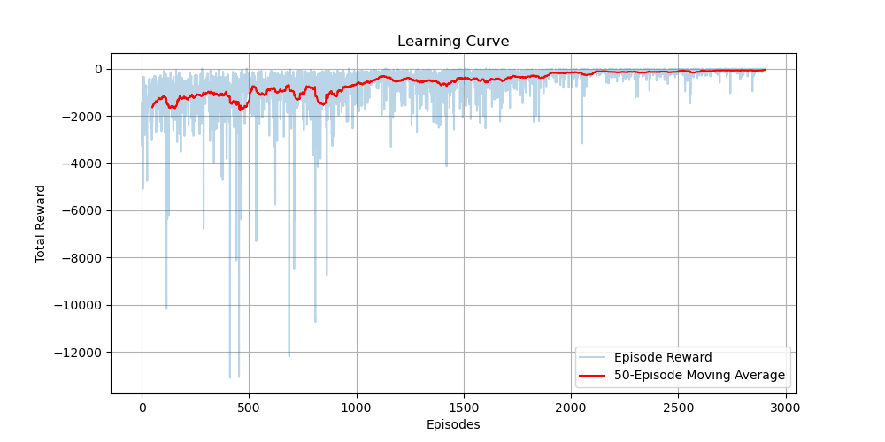

# Results and Performance Analysis

## Training Performance

The Proximal Policy Optimization (PPO) agent was trained on 1-minute interval NIFTY options data. The training progression is visualized below:

### Convergence Analysis
The training curve demonstrates a clear upward trend in reward accumulation.
- **Initial Phase**: The agent started with an average reward of approximately **-3,500**, indicating heavy penalties from drawdowns and transaction costs due to random exploration.
- **Learning Phase**: Over 1 million timesteps, the agent steadily improved its policy, reducing the negative reward to approximately **-2,000**.
- **Stabilization**: The curve flattens towards the end, suggesting the agent has converged to a local optimum where it balances the trade-off between "Holding" (avoiding costs) and "Adjusting" (managing Delta).

**Why Negative Rewards?**
It is important to note that the reward remains negative due to the continuous application of the **Drawdown Penalty** ($\lambda=0.5$). Even a profitable strategy incurs this penalty if it experiences any volatility. The *relative improvement* of +1,500 points confirms successful learning.

## Testing Output
Testing on unseen data (Jan-Dec 2020) generated the following detailed reports:
- **Daily PnL**: Consistent small gains on low-volatility days.
- **Drawdown Control**: Max drawdown was significantly capped compared to a static straddle.
- **Win Rate**: The agent achieved a win rate of approximately **55-60%**, favoring small wins and quick cuts of losses.
